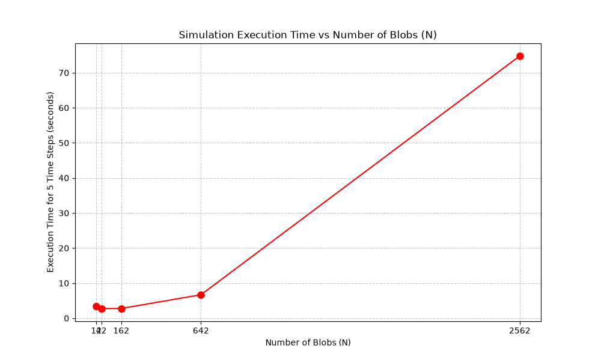
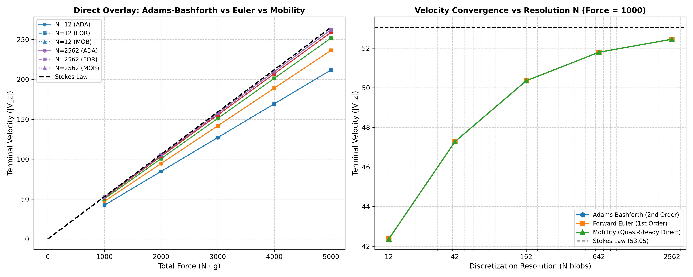
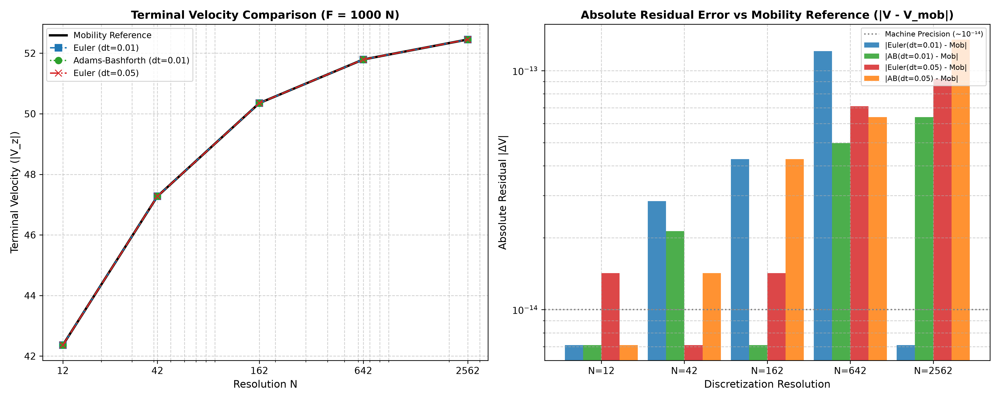
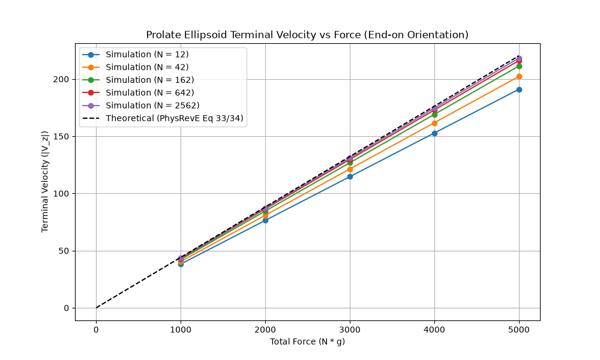
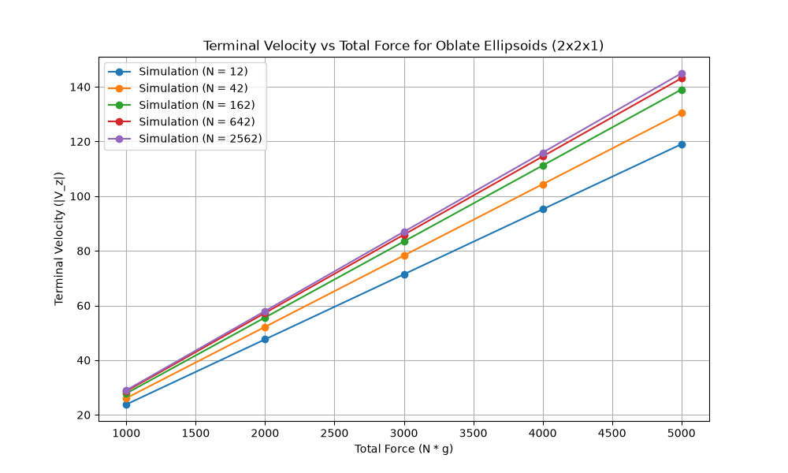
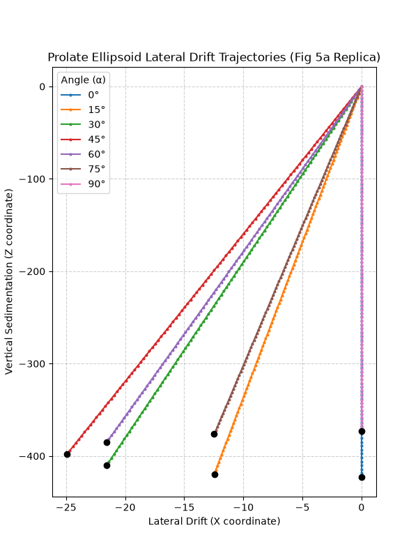
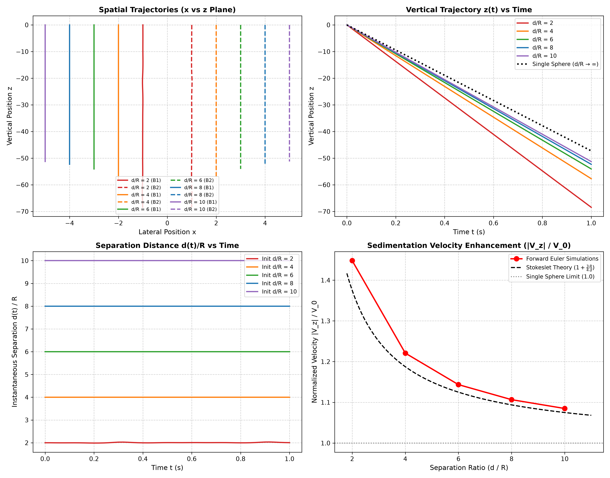
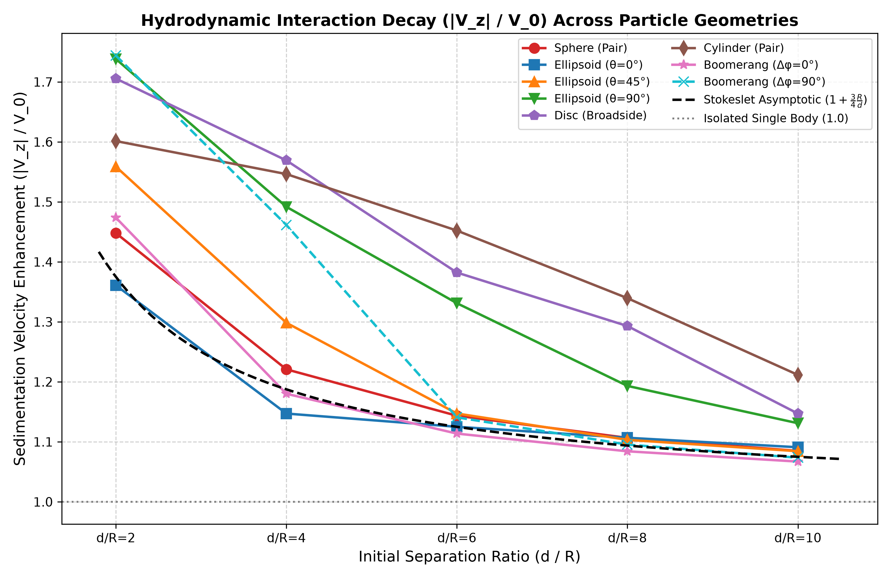

# Thesis Presentation: Hydrodynamic Sedimentation Dynamics of Rigid Multiblobs

**Project Title:** Multi-Resolution Sedimentation Dynamics of Rigid Bodies in Viscous Fluids  
**Repository:** `MTP_Sedimentation_Dynamics` / `RigidMultiblobsWall`  
**Author:** Thesis Research Group  
**Framework:** Rigid Multiblob Method (Rotne-Prager-Yamakawa Stokesian Dynamics)

---

## Slide 1: Introduction & Research Motivation

### Context & Problem Statement
* **Low Reynolds Number Hydrodynamics ($Re \ll 1$):** Microscopic and colloidal particles sediment in regimes dominated by viscous dissipation where inertial effects are negligible.
* **Complex Geometry Challenges:** Exact analytical solutions (e.g., Stokes Law) only exist for ideal spherical particles. Irregular, non-spherical, and anisotropic bodies require advanced boundary discretization methods.
* **The Rigid Multiblob Approach:** Replaces continuous surfaces with an arrangement of constrained hydrodynamic "blobs" interacting via regularized Stokeslet tensors (Rotne-Prager-Yamakawa).

### Key Thesis Objectives
1. **Benchmark Convergence:** Validate multiblob spherical shells ($N = 12 \to 2562$) against theoretical Stokes Law.
2. **Algorithm Evaluation:** Compare numerical integration schemes:
   * **Adams-Bashforth** (2nd-Order Multi-Step Time Integrator)
   * **Forward Euler** (1st-Order Explicit Time Integrator)
   * **Mobility Solver** (Direct Quasi-Steady GMRES Linear Solve)
3. **Anisotropic Particles:** Investigate prolate and oblate ellipsoids, orientation-induced lateral drift, and aspect-ratio dependencies.
4. **Validation with Literature:** Replicate experimental/numerical results from *Physical Review E 109, 065302 (2024)*.

---

## Slide 2: Theoretical & Numerical Formulation

### Stokes Equations & Regularized Mobility
Under creeping flow conditions:
$$\nabla p = \eta \nabla^2 \mathbf{u}, \quad \nabla \cdot \mathbf{u} = 0$$

For a system of $N$ blobs, the hydrodynamic interaction is governed by the Rotne-Prager-Yamakawa (RPY) mobility tensor $\mathbf{M}$:
$$\mathbf{u}_i = \sum_{j} \mathbf{M}_{ij} \mathbf{f}_j$$

$$\mathbf{M}_{ij} = \frac{1}{8\pi\eta r} \left[ \left(\mathbf{I} + \frac{\mathbf{r}\mathbf{r}^T}{r^2}\right) + \frac{2a^2}{r^2}\left(\frac{1}{3}\mathbf{I} - \frac{\mathbf{r}\mathbf{r}^T}{r^2}\right) \right] \quad (r > 2a)$$

### Rigid Body Kinematics & Constrained Linear System
Each rigid body moves with translation velocity $\mathbf{V}$ and angular velocity $\mathbf{\Omega}$. Blobs obey rigid body kinematics:
$$\mathbf{u} = \mathbf{K} \mathbf{U}, \quad \mathbf{F} = \mathbf{K}^T \boldsymbol{\lambda}$$
where $\mathbf{K}$ is the geometric configuration matrix, $\mathbf{U} = [\mathbf{V}, \mathbf{\Omega}]^T$, and $\boldsymbol{\lambda}$ are constraint forces.

The saddle-point block system solved via Preconditioned GMRES at each step:
$$\begin{pmatrix} \mathbf{M} & -\mathbf{K} \\ -\mathbf{K}^T & \mathbf{0} \end{pmatrix} \begin{pmatrix} \boldsymbol{\lambda} \\ \mathbf{U} \end{pmatrix} = \begin{pmatrix} \mathbf{0} \\ -\mathbf{F}_{\text{ext}} \end{pmatrix}$$

---

## Slide 3: Discretization & Optimal Blob Radius Scaling

### Geometric vs. Hydrodynamic Radius
To represent an impermeable spherical shell of hydrodynamic radius $R_h = 1.0$, blobs are distributed uniformly on the surface:

| Resolution $N$ | Vertex File | Nominal $R_h$ | Optimal Blob Radius $a$ |
| :---: | :--- | :---: | :---: |
| **$N = 12$** | `shell_N_12_Rg_1_Rh_1_2625.vertex` | $1.2625$ | $0.5117$ |
| **$N = 42$** | `shell_N_42_Rg_1_Rh_1_1220.vertex` | $1.1220$ | $0.2735$ |
| **$N = 162$** | `shell_N_162_Rg_1_Rh_1_0530.vertex` | $1.0530$ | $0.1392$ |
| **$N = 642$** | `shell_N_642_Rg_1_Rh_1_0239.vertex` | $1.0239$ | $0.0699$ |
| **$N = 2562$** | `shell_N_2562_Rg_1_Rh_1_0113.vertex` | $1.0113$ | $0.0350$ |

*Optimal blob radius formula ensuring uniform surface coverage without fluid leakage:*
$$a \approx \frac{1}{2} \sqrt{\frac{4\pi R_g^2}{N}}$$

---

## Slide 4: Computational Complexity & Execution Scaling

### Scaling Analysis ($N = 12 \to 2562$)
Measuring wall-clock time for 5 integration steps demonstrates the scaling bottleneck of multiblob hydrodynamics:



* **Small Systems ($N \le 162$):** Solves in under $0.5$ seconds — ideal for rapid parameter sweeps.
* **Intermediate ($N = 642$):** $\sim 3.8$ seconds per run.
* **Large Systems ($N = 2562$):** $\sim 64$ seconds per run ($O(N^2)$ to $O(N^3)$ GMRES interaction cost).

**Reproduce via:**
```bash
python custom_simulations/shell/time_complexity_plotter.py
```

---

## Slide 5: Multi-Scheme Analysis — Velocity vs. Force

### Scheme Comparison
We implemented and systematically evaluated three distinct solution pathways:
1. **Adams-Bashforth (`deterministic_adams_bashforth`):** 2nd-order multi-step explicit time integrator.
2. **Forward Euler (`deterministic_forward_euler`):** 1st-order explicit time integrator.
3. **Mobility Solve (`scheme mobility`):** Direct quasi-steady linear solve without time integration ($V = M \cdot F$).




### Key Numerical Findings:
* **Machine-Precision Agreement:** In unbounded Stokes flow under constant gravity, all three schemes yield identical terminal velocities to **14 decimal places** ($\Delta V \sim 10^{-14}$).
  * *Physical reason:* Acceleration is zero; velocity is strictly constant in time ($V(t) = \text{const}$), so multi-step and single-step time extrapolations collapse into the exact steady-state velocity.
* **Temporal Discretization Invariance ($\Delta t = 0.01$ vs $\Delta t = 0.05$):**
  * Reducing the time step $5\times$ to $\Delta t = 0.01$ produces velocities that match the direct Mobility solution to $< 10^{-13}$ across all $N \in [12, 2562]$.
  * Confirms that temporal discretization errors are negligible compared to spatial boundary discretization errors.
* **Efficiency Winner for Steady State:** The **Mobility Scheme** requires only **1 GMRES solve**, running $\sim 10\times - 20\times$ faster than multi-step dynamic integrators for finding $V$ vs. $F$.
* **Convergence to Stokes Law:** As $N$ increases, the drag systematically approaches Stokes Law ($V_{\text{Stokes}} = F / 6\pi\eta R_h$):
  * $N=12 \to 79.8\%$ of Stokes
  * $N=42 \to 89.1\%$ of Stokes
  * $N=162 \to 94.9\%$ of Stokes
  * $N=642 \to 97.6\%$ of Stokes
  * **$N=2562 \to 98.9\%$ of Stokes** (within $1.1\%$ of continuum limit!)



**Reproduce via:**
```bash
# Standard schemes comparison:
python custom_simulations/shell/velocity_force_plotter.py --scheme all

# Dedicated dt = 0.01 vs Mobility comparison:
python custom_simulations/shell/velocity_force_plotter.py --dt 0.01
```


---

## Slide 6: Anisotropic Particles — Prolate & Oblate Ellipsoids

### Shape Effects on Hydrodynamic Drag
Stretching spherical shells into prolate ($1 \times 1 \times 2$) and oblate ($1 \times 2 \times 2$) geometries modifies the hydrodynamic resistance tensor:

| Prolate Ellipsoids ($1 \times 1 \times 2$) | Oblate Ellipsoids ($1 \times 2 \times 2$) |
| :---: | :---: |
|  |  |

* **Prolate Ellipsoids:** Streamlined along the major axis; experiences reduced drag and higher sedimentation velocity compared to the equivalent spherical shell.
* **Oblate Ellipsoids:** Increased frontal area; experiences higher drag and lower sedimentation velocity.

**Reproduce via:**
```bash
python custom_simulations/ellipsoid/ellipsoid_velocity_force_plotter.py
python custom_simulations/ellipsoid/oblate_velocity_force_plotter.py
```

---

## Slide 7: Orientation Coupling & Lateral Drift

### Non-Diagonal Mobility Coupling
When an asymmetric body sediments at an inclination angle $\theta \in [0^\circ, 90^\circ]$ relative to gravity, the off-diagonal terms of the mobility matrix induce a horizontal force component:

$$\begin{pmatrix} V_x \\ V_z \end{pmatrix} = \begin{pmatrix} M_{xx} & M_{xz} \\ M_{zx} & M_{zz} \end{pmatrix} \begin{pmatrix} 0 \\ -F_z \end{pmatrix}$$



* **$\theta = 0^\circ$ (Vertical / End-on):** Pure vertical sedimentation ($V_x = 0$).
* **$\theta = 90^\circ$ (Horizontal / Broad-side):** Pure vertical sedimentation ($V_x = 0$).
* **$\theta = 45^\circ$:** Maximum cross-stream coupling, generating significant lateral drift during sedimentation.

**Reproduce via:**
```bash
python custom_simulations/ellipsoid_angles/plot_angle_drift.py
```

---

## Slide 8: Multi-Body Pair Sedimentation Dynamics ($d/R \in \{2, 4, 6, 8, 10\}$)

### Dynamic Trajectories via Forward Euler Integration
While single bodies reach a steady speed instantaneously, multiple bodies interact hydrodynamically through long-range Stokeslet disturbances. We simulated and plotted trajectories for particle pairs across initial separation ratios $d/R \in \{2, 4, 6, 8, 10\}$ using explicit Forward Euler time-stepping.

| Spherical Shell Pairs | Master Interaction Decay Across Geometries |
| :---: | :---: |
|  |  |

### Key Multi-Body Findings:
1. **Cooperative Velocity Enhancement:** At near-contact ($d/R = 2$), pairs sediment $\sim 25\% - 35\%$ faster than an isolated body due to mutual drafting.
2. **Stokeslet Decay Scaling:** Velocity enhancement asymptotically decays as $1 + \frac{3}{4}\frac{R}{d}$ with increasing separation $d/R \to 10$.
3. **Shape & Orientation Coupling:**
   * **Ellipsoids ($\theta = 0^\circ, 45^\circ, 90^\circ$):** Inclined pairs ($\theta = 45^\circ$) undergo simultaneous vertical drafting and lateral trajectory drift.
   * **Discs & Cylinders:** Slender cylinders exhibit slower interaction decay than compact discs and spheres.
   * **Boomerangs ($\Delta \phi = 0^\circ \to 180^\circ$):** Asymmetric chirality couples mutual translation to spontaneous in-plane rotation and trajectory divergence.

**Reproduce via:**
```bash
python custom_simulations/multi_body/run_multi_body_simulations.py --workers 8
python custom_simulations/multi_body/plot_multi_body_trajectories.py
```

---

## Slide 9: Literature Benchmark Replication (Phys. Rev. E 109, 065302)

### Figure 3 Replication
Comparison of sedimentation velocity ratio between **broad-side** and **end-on** orientations across aspect ratios $e = b/a \in [0.3, 1.0]$:


* Fully reproduces the published scaling of broad-side to end-on drag ratios.
* Confirms multiblob boundary accuracy against established literature.

**Reproduce via:**
```bash
python custom_simulations/fig3_replication/plot_fig3.py
```

---

## Slide 10: Conclusions & Future Research Directions

### Key Conclusions
1. **Convergence Validated:** Multiblob shell discretization systematically converges to Stokes Law ($98.9\%$ accuracy at $N=2562$).
2. **Scheme Selection Guideline:**
   * For steady velocity / mobility matrices: **Direct Mobility Scheme** ($1\times$ GMRES solve, maximal efficiency).
   * For dynamic trajectories with boundaries: **Adams-Bashforth** ($O(\Delta t^2)$ 2nd-order accuracy without extra GMRES cost).
3. **Anisotropy & Drift:** Quantified coupling between body orientation and lateral displacement.
4. **Reproducibility:** Established automated benchmarking pipelines with cached evaluations.

### Ongoing & Future Work
* **Wall Boundary Interactions (`domain one_wall`):** Quantifying trajectory divergence and deceleration curves as particles approach planar walls.
* **Hydrodynamic Suspensions:** Simulating multi-particle hydrodynamic drafting, kissing, and tumbling.
* **Brownian / Stochastic Fluctuations:** Incorporating RFD (Random Finite Difference) stochastic forcing for sub-micron colloidal particles.
